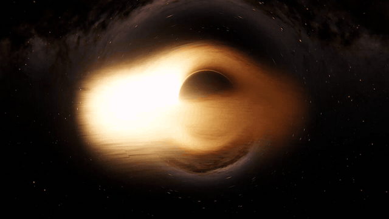

# Black Hole Renderer

A real-time, ray-marched black hole for Unity URP. Gravitational lensing of your skybox, and a spinning accretion disk with blackbody color, a physically based temperature profile, and relativistic Doppler and gravitational redshift.



## Installation

Requires **Unity 6** with **URP** (RenderGraph).

In Unity, open **Window → Package Manager**, click **+ → Install package from git URL…**, and enter:

```
https://github.com/cannoli-cat/black-hole-renderer.git#v2.2.1
```

## Setup

1. Add **Black Hole Feature** to your URP renderer (Renderer asset → **Add Renderer Feature**), and assign the `BlackHole` shader and `BlackHole` compute shader from this package.
2. Add the **Black Hole** component to a GameObject. Its position is the black hole's position.
3. Use a **cubemap skybox** material in Lighting settings. It's what gets lensed. Without one, the background renders black.

Tune the radius, spin, disk size, temperature, disk exposure and sky intensity on the renderer feature.

## Presets

The renderer feature has a **Preset** field. Assign one and click **Apply** to copy its values into the settings, or click **Save Current to Preset** to store yours. The package includes:

- **Realistic**: a physically based thin disk around a fast-spinning black hole.
- **Quasar**: a hotter, brighter, more turbulent disk.
- **M87**: a thick, dim, orange disk, like the Event Horizon Telescope image.
- **Interstellar**: a Gargantua-style disk with no Doppler shift, long hair-like streaks and a frayed outer edge.

Create your own with **Create → CannoliCat → Black Hole Preset**.

## Ray tracing

**Exact** (the default) traces true Kerr light paths around a spinning black hole. **Fast** uses Schwarzschild bending with approximate frame dragging. It's cheaper, so use it on WebGL and mobile.

## Disk look

Everything is physically based by default. **Doppler Strength** and **Temperature Falloff** at 1 are physical. Lower them for an *Interstellar*-style disk.

The turbulence settings shape the gas:

- **Turbulence Contrast**: how much the turbulence heats and cools the gas.
- **Filament Sharpness**: soft clouds at 0, sharp filaments at 1.
- **Turbulence Warp**: swirls the gas into eddies.
- **Orbital Stretch**: stretches the gas into streaks along the orbit.
- **Edge Fraying**: breaks the outer disk into separate wispy strands.
- **Plunging Gas** and **Plunge Glow**: gas spiralling in from the disk's inner edge to the horizon.

For the best result, turn on **HDR** in your URP asset and use a tonemapper (Neutral or ACES). The disk is much brighter than 1, and without HDR the bright side gets clipped to flat white.

## License and attribution

**CC BY 4.0.** You may use, modify and redistribute this, including in commercial games, **as long as you give credit.**
In your game's credits (or documentation / about screen), include:

> Black Hole Renderer by Tyler Wolfe (cannoli-cat) — https://github.com/cannoli-cat/black-hole-renderer

See [LICENSE.md](LICENSE.md) for the full license text.
